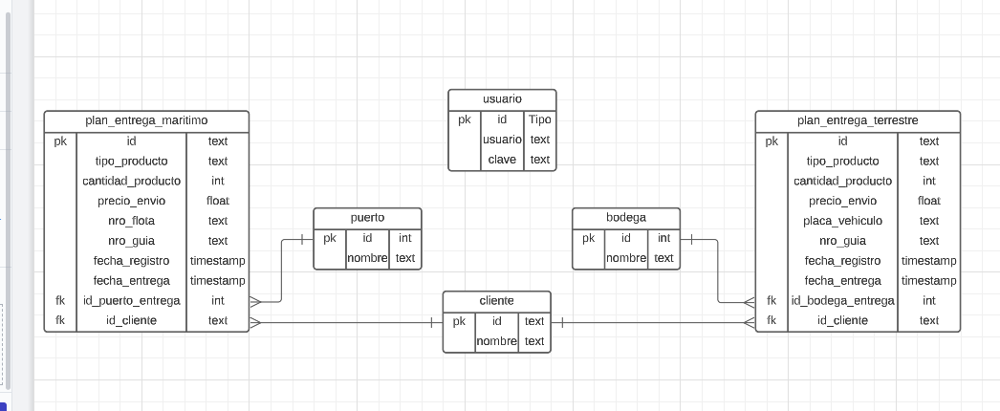

- [DOCUCENTER](#docucenter)
  - [Ejecutar el proyecto](#ejecutar-el-proyecto)
    - [Backend(En Local)](#backenden-local)
    - [Frontend(En Local)](#frontenden-local)
  - [Diagrama E-R](#diagrama-e-r)
  - [Detalles de la Base de datos (POSTGRESQL)](#detalles-de-la-base-de-datos-postgresql)
  - [BACKEND (GOLANG)](#backend-golang)
  - [FRONTEND (REACT JS)](#frontend-react-js)
# DOCUCENTER

## Ejecutar el proyecto

### Backend(En Local)

1. Crear una BD en POSTGRESQL con el nombre **docucenter_joseguzman**.
2. Usar el script denominado **tablas.sql** para crear las tablas.
3. Ubicarse en la carpeta **./cmd/api**
4. Ejecutar:

```go run .```

### Frontend(En Local)

1. Tener instalado Node
2. Ubicarse dentro de la carpeta del frontend
3. Ejecutar:
   
```npm run start```

1. Esperar que se abra el nvegador con la URL
2. Credenciales de acceso:

```usuario: admin , clave : 123```

## Diagrama E-R 

[Enlace al Diagrama E-R](https://lucid.app/lucidchart/e96ad0cd-2575-4365-9b84-2042fca11f27/edit?viewport_loc=-39%2C-804%2C2082%2C967%2C0_0&invitationId=inv_f1d49ccf-b163-4e2b-bdf2-1945b5735467)



## Detalles de la Base de datos (POSTGRESQL)

- La clave del usuario no está encriptada(usuario: admin, clave: 123)
- Las tablas **puerto** y **bodega** contienen datos por defecto, ***no eliminar***.
- En el Frontend: Se tomaron como referencia los datos de las tablas mencionadas en el punto anterior.
- En el Frontend: La tabla **cliente** si es consultada para mostrar los clientes de la BD, en los formularios.
- En algunas PK se consideró códigos UUID creados en el Backend, previos al INSERT.

## BACKEND (GOLANG)

1. Arquitectura Hexagonal (Clean architecture)
2. Patron Repository
3. Seeguridad de los servicios con JWT
4. CRUD API para logistica terrestre y maritima
5. Validación de campos según requerimiento (placa vehiculo, nro. de guia, nro. de flota y dscto.)
6. Clean Code
7. Convenciones del lenguaje GOLANG [Enlace convenciones oficiales](https://go.dev/doc/effective_go)
8. Otros detalles a mencionar:
   
   - No editar el archivo .ENV

## FRONTEND (REACT JS)

1. Login básico funcional
2. Protección de rutas
3. Validación de formatos y campos según el requerimiento.

>Quedo atento cualquier novedad.

Autor: Jose Guzman Chuman / jalfred.076@gmail.com


